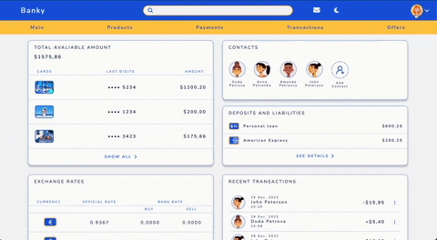

- [Overview](#overview)
  - [Screenshot](#screenshot)
  - [Links](#links)
  - [Built with](#built-with)

## Overview

Banky is a user interface that I designed and built as a means to practice my Grid layout skills. Throughout the development process, I took the opportunity to implement various additional features, such as a custom dropdown menu, responsive design, and a dark mode. All these features helped me take my front-end development skills to the next level and create a user interface that looks good and works great!

### Screenshot

### Links

- Live Site URL: https://padmed.github.io/BankyUI/

### Built with

- Semantic HTML5 markup
- SCSS
- JavaScript
- Flexbox
- CSS Grid
- Mobile-first workflow
- Figma
